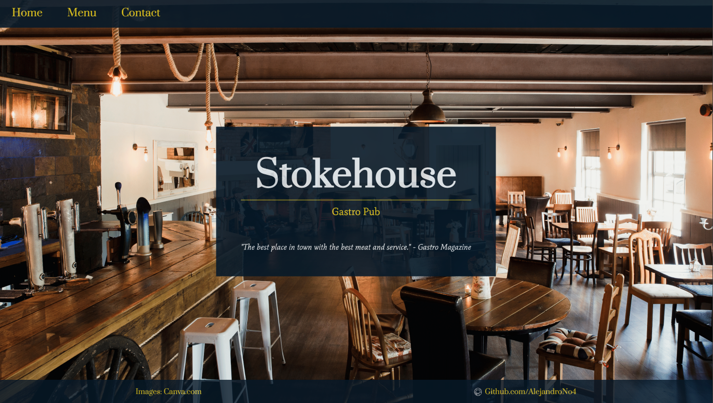

# Restaurant Page

> A restaurant page made with javascript using Webpack.

  

This project is part of the Microverse curriculum "Javascript." It is made with learning proposes. To practice the creation of a web page using javascript and Webpack.

The structure is designed so that the index.js document imports all the modules to visit. (home.js, menu.js
, and contact.js) Also, here is the code that handles the page content change.

That is, the content is not at different HTML pages, but Webpack compiles the javascript modules to generate a single file that can be read by the web browser.

## Live Version

[Live version here!](https://alejandrono4.github.io/restaurant-page/)

## Getting Started

To get a local copy up and running follow these simple example steps.

- At first, you have to clone this repository. Open your terminal and paste this without the $ sign.

      $ git clone https://github.com/AlejandroNo4/restaurant-page.git

- Now that you have the repository in your local machine. Change the direction of the local file with your terminal. Just type "$ cd" (without the $ sign) and the path to reach the restaurant-page folder. 
  Something like:

        $ cd User/Documents/restaurant-page

- You are done! Now to open the project on your text editor, just type:

      $ code .

- Once inside, to run the project, open the "dist" folder. Then right-click on the index.html file and click on open with Live Server.

 

## Built With

- Javascript
- VS Code
- Git
- HTML
- CSS

## Author

👤 **Author1**

- GitHub: [@AlejandroNo4](https://github.com/AlejandroNo4)
- Twitter: [@Alejand80002666](https://twitter.com/Alejand80002666)
- LinkedIn: [Alejandro Contreras Rodriguez](https://www.linkedin.com/in/alejandro-contreras-rodriguez-b524821b5)

## 🤝 Contributing

Contributions, issues, and feature requests are welcome!

Feel free to check the [Issues page](https://github.com/AlejandroNo4/restaurant-page/issues).

## Show your support

Give a ⭐️ if you like this project!

## Acknowledgments

- Images from [Canva.com](https://www.canva.com/)
- Fonts from [google fonts](https://fonts.google.com/) ("Mate" and "Prata")

## 📝 License

This project is [MIT](./MIT.md) licensed.
